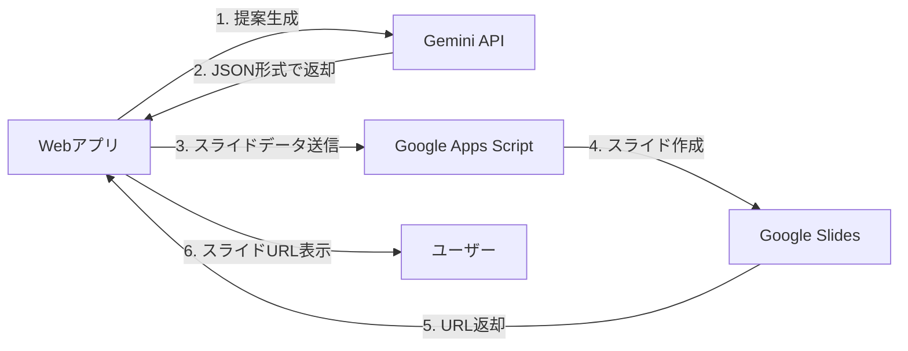

# 📋 簡略化されたワークフロー - N8N不要版

## 🎯 変更概要

メール/Slack通知が不要とのことで、**N8Nを使わずに直接スライド生成**まで行うように変更しました。

## 🔄 新しいワークフロー



### 処理の流れ

1. **ユーザーが会議を選択** → チェックボックスで選択
2. **「提案資料を生成」ボタンクリック**
3. **Gemini APIで提案内容とスライドデータ生成**
4. **Google Apps Scriptにデータを直接送信**
5. **Googleスライド生成**
6. **スライドURLを返却・表示**
7. **ブラウザで自動的にスライドを開く**（1件の場合）

## 🚀 使い方

### 1. プレビュー（変更なし）
- 提案内容を確認したい時に使用
- スライドは生成されない
- 即座に内容が表示される

### 2. スライド生成（新機能）
```javascript
// ボタンクリック時の動作
1. 選択した会議ごとに処理
2. Gemini APIで提案生成（JSON形式）
3. GASでスライド作成
4. スライドURLを自動で開く
```

## 📝 必要な設定

### 1. Google Apps Script のデプロイ

1. [Google Apps Script](https://script.google.com) にアクセス
2. 新規プロジェクト作成
3. `gas-slide-generator/Code.gs` の内容をコピー
4. デプロイ → 新しいデプロイ
5. 種類: **ウェブアプリ**
6. アクセスできるユーザー: **全員**
7. デプロイ後のURLをコピー

### 2. 環境変数の設定

**ローカル開発** (`web/.env.local`):
```bash
GAS_SLIDE_GENERATOR_URL=https://script.google.com/macros/s/YOUR_SCRIPT_ID/exec
```

**本番環境** (Vercel):
同じURLを環境変数に追加

## 🎨 Geminiが生成するスライドデータ例

```json
{
  "slides": [
    {
      "type": "title",
      "title": "株式会社ABC 様\nDX推進提案資料",
      "date": "2025/10/25"
    },
    {
      "type": "agenda",
      "title": "アジェンダ",
      "sections": [
        {
          "heading": "現状分析",
          "content": ["業務課題の整理", "デジタル化の現状"]
        },
        {
          "heading": "提案内容",
          "content": ["業務効率化", "顧客体験向上", "データ活用"]
        }
      ]
    },
    {
      "type": "content",
      "title": "業務効率化ツールの導入",
      "sections": [
        {
          "heading": "推奨ツール",
          "content": ["Slack - チームコミュニケーション", "Notion - ドキュメント管理"]
        },
        {
          "heading": "導入効果",
          "content": ["作業時間30%削減", "情報共有スピード2倍"]
        },
        {
          "heading": "投資額",
          "content": ["初期費用: 50万円", "月額: 3万円"]
        }
      ]
    },
    {
      "type": "closing",
      "title": "ご清聴ありがとうございました"
    }
  ]
}
```

## ✅ メリット

### N8Nを使わないことで：

1. **シンプル化**
   - 複雑なワークフロー管理が不要
   - 認証エラーのリスク軽減
   - デバッグが容易

2. **高速化**
   - 中間サーバーを経由しない
   - 直接的な通信で遅延削減

3. **メンテナンス性向上**
   - N8Nの更新・管理不要
   - エラー箇所の特定が簡単

4. **コスト削減**
   - N8Nサーバーの運用コスト不要

## ⚠️ 注意事項

### GAS（Google Apps Script）の制限

- **実行時間**: 最大6分
- **URLフェッチサイズ**: 50MB
- **作成可能スライド数**: 実質無制限（時間内）

### 対処法

複数の会議を選択した場合：
- 1件ずつ順次処理
- エラーが発生しても次の処理を継続
- 各スライドのURLを収集して表示

## 🔧 トラブルシューティング

### スライドが生成されない場合

1. **GAS URLの確認**
   ```bash
   echo $GAS_SLIDE_GENERATOR_URL
   ```

2. **GASの実行権限**
   - 全員がアクセス可能に設定されているか確認

3. **Geminiのレスポンス**
   - コンソールログでJSON形式を確認
   - 正しいフォーマットか検証

### エラーが発生する場合

```javascript
// デバッグ用コード追加
console.log('Gemini response:', proposalText);
console.log('Parsed slides:', slideData);
console.log('GAS response:', gasData);
```

## 📊 実行フロー例

```
ユーザー: 会議を3件選択して「提案資料を生成」クリック
    ↓
システム:
  1件目: Gemini → GAS → スライド生成 ✓
  2件目: Gemini → GAS → スライド生成 ✓
  3件目: Gemini → GAS → スライド生成 ✓
    ↓
結果: 「3件の提案資料を生成しました」
      最初のスライドを新しいタブで開く
```

## 🎯 まとめ

**変更前**: Webアプリ → N8N → Gemini → GAS → メール/Slack
**変更後**: Webアプリ → Gemini → GAS → 完了

これにより：
- **N8Nが不要**になりました
- **メール/Slack通知を削除**しました
- **直接スライドURLを取得**できます
- **処理が高速化**されました

---

**最終更新**: 2025-10-25
**作成者**: Claude Code